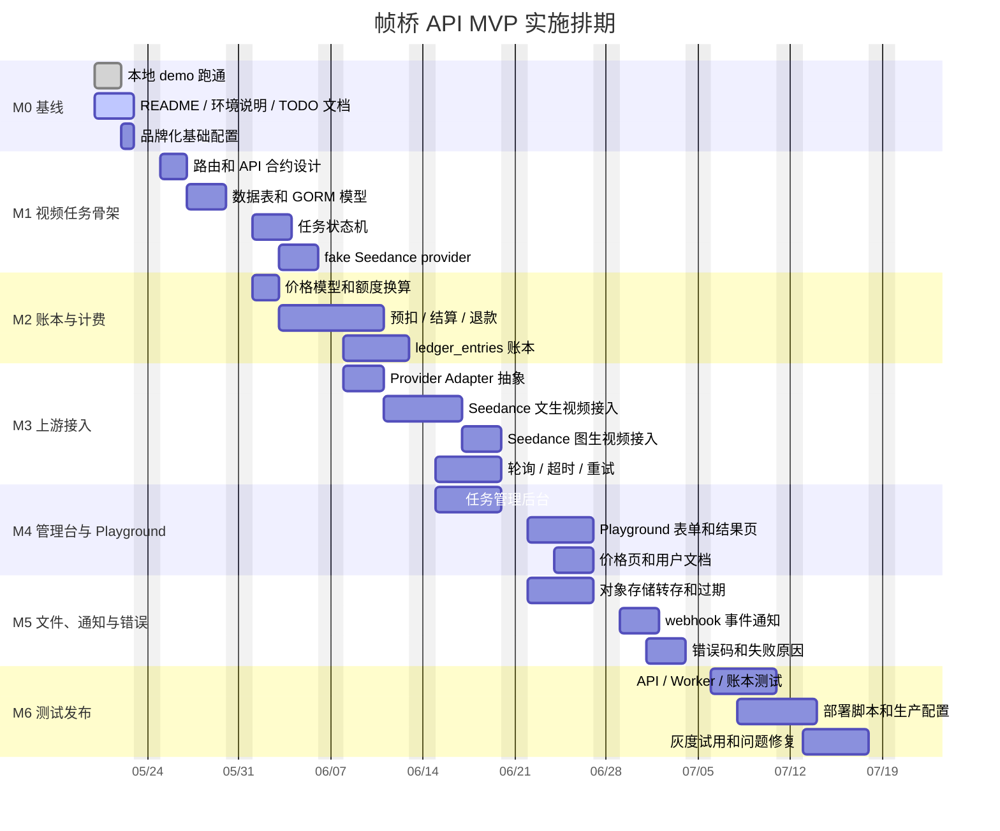

# 帧桥 API 项目实施进度跟踪

最后更新：2026-05-21
当前阶段：本地 demo 已跑通，进入 Seedance 视频任务 MVP 设计与开发准备阶段。

## 项目目标

帧桥 API 基于 One API 二次开发，先复用 One API 的用户、令牌、渠道、额度、日志、兑换码和管理后台能力，再补齐 Seedance 视频生成业务所需的异步任务、预扣费、结算、失败退款、账本、对象存储、webhook 和 playground。

MVP 验收目标：

- 用户可以注册 / 登录 / 创建 API Key。
- 管理员可以配置一个稳定的 Seedance 上游渠道。
- 用户可以通过 API 创建视频生成任务。
- 用户可以查询任务状态并拿到视频结果。
- 创建任务时可以预扣额度，成功后结算，失败 / 超时后退款。
- 管理后台可以查看任务、扣费、退款和上游错误。
- 有基础文档，包含 curl、Python、Node.js 示例。

## 范围边界

### MVP 范围

- One API 基础服务二开和品牌化。
- 视频任务 API：创建、查询、取消、下载。
- Seedance 单上游接入。
- 视频任务状态机和 Worker。
- 预扣、结算、退款和账本。
- 任务管理后台和 Playground。
- 对象存储转存和文件过期策略。
- webhook 基础通知。
- 本地、测试环境、生产环境部署文档。

### MVP 暂不做

- 自动支付，先使用人工充值 / 兑换码。
- 多上游容灾，先保留 Provider Adapter 扩展点。
- 团队账户、发票、分销、复杂会员体系。
- Kling、Veo、Runway、Sora 等多模型扩展。
- 复杂创作工作台、模板库、批量生成。

## 排期总览

粗排期从 2026-05-20 开始，到 2026-07-17 完成 beta 发布。整体预估 9 周，其中第 8-9 周包含联调、灰度和缓冲。

| 里程碑 | 时间 | 目标 | 验收标准 | 状态 |
|---|---:|---|---|---|
| M0 本地 demo 和二开基线 | 2026-05-20 至 2026-05-24 | 本地环境、README、基础启动链路稳定 | 本地后台可访问，MySQL / Redis 可用，源码服务可启动 | 进行中 |
| M1 视频任务骨架 | 2026-05-25 至 2026-06-05 | 新增视频任务 API、表结构、状态机和 fake provider | fake 任务可完成 `pending -> running -> succeeded` | 未开始 |
| M2 账本和扣费退款 | 2026-06-01 至 2026-06-12 | 完成预扣、结算、退款、账本记录 | 成功扣费，失败退款，后台可追溯 | 未开始 |
| M3 Seedance 上游接入 | 2026-06-08 至 2026-06-19 | 接入真实 Seedance 上游，支持文生视频 / 图生视频 | API 可创建真实任务并轮询到结果 | 未开始 |
| M4 产品化后台 | 2026-06-15 至 2026-06-26 | 任务面板、Playground、价格页、文档示例 | 用户可在页面测试任务并查看记录 | 未开始 |
| M5 webhook、对象存储和错误码 | 2026-06-22 至 2026-07-03 | 文件转存、webhook、错误码、失败原因 | 结果可下载，事件可通知，错误可定位 | 未开始 |
| M6 测试、部署和 beta | 2026-07-06 至 2026-07-17 | 联调、压测、灰度、生产部署 | beta 环境稳定运行，完成发布清单 | 未开始 |

## 甘特图

## 任务跟踪

| ID | 模块 | 任务 | 开始 | 结束 | 负责人 | 产出 | 状态 |
|---|---|---|---:|---:|---|---|---|
| T00 | 基线 | 本地 Docker / Colima / MySQL / Redis 环境 | 2026-05-20 | 2026-05-20 | TBD | 本地依赖可启动 | 已完成 |
| T01 | 基线 | 源码服务启动和前端 build 修复 | 2026-05-20 | 2026-05-20 | TBD | `http://localhost:3000` 可访问 | 已完成 |
| T02 | 文档 | README、本地启动、开发测试流程 | 2026-05-20 | 2026-05-21 | TBD | README 二开指南 | 已完成 |
| T03 | 品牌 | 系统名称、logo、文案调整为帧桥 API | 2026-05-22 | 2026-05-22 | TBD | 基础品牌化页面 | 已完成 |
| T04 | API | 视频任务 API 合约和错误码草案 | 2026-05-25 | 2026-05-26 | TBD | API 设计文档 / 路由草案 | 未开始 |
| T05 | 数据 | `video_tasks`、`video_task_events`、`provider_jobs` 模型 | 2026-05-27 | 2026-05-29 | TBD | GORM model 和迁移 | 未开始 |
| T06 | Worker | 任务状态机和后台 Worker | 2026-06-01 | 2026-06-03 | TBD | 状态流转和队列消费 | 未开始 |
| T07 | Provider | fake Seedance provider | 2026-06-03 | 2026-06-05 | TBD | 本地假任务闭环 | 未开始 |
| T08 | 计费 | 定价模型和额度换算 | 2026-06-01 | 2026-06-02 | TBD | 模型 / 时长 / 分辨率价格表 | 未开始 |
| T09 | 计费 | 预扣、成功结算、失败退款 | 2026-06-03 | 2026-06-10 | TBD | 计费服务和单测 | 未开始 |
| T10 | 账本 | `ledger_entries` append-only 账本 | 2026-06-08 | 2026-06-12 | TBD | 可审计账本记录 | 未开始 |
| T11 | 上游 | Seedance Provider Adapter | 2026-06-08 | 2026-06-10 | TBD | Provider 接口和实现骨架 | 未开始 |
| T12 | 上游 | 文生视频真实上游接入 | 2026-06-11 | 2026-06-16 | TBD | 可创建真实文生视频任务 | 未开始 |
| T13 | 上游 | 图生视频真实上游接入 | 2026-06-17 | 2026-06-19 | TBD | 可创建真实图生视频任务 | 未开始 |
| T14 | 后台 | 任务列表、任务详情、手动退款 | 2026-06-15 | 2026-06-19 | TBD | 管理后台任务面板 | 未开始 |
| T15 | 前台 | Playground prompt / 图片 / 时长 / 比例表单 | 2026-06-22 | 2026-06-26 | TBD | 可视化测试页面 | 未开始 |
| T16 | 存储 | 视频转存对象存储和过期策略 | 2026-06-22 | 2026-06-26 | TBD | 稳定下载链接 | 未开始 |
| T17 | 通知 | webhook 配置、签名和测试接口 | 2026-06-29 | 2026-07-01 | TBD | 用户 webhook 通知 | 未开始 |
| T18 | 文档 | curl、Python、Node.js API 示例 | 2026-06-24 | 2026-06-26 | TBD | 开发者接入文档 | 未开始 |
| T19 | 测试 | API、Worker、账本、退款测试 | 2026-07-06 | 2026-07-10 | TBD | 自动化测试和冒烟清单 | 未开始 |
| T20 | 发布 | 生产部署、监控、备份、灰度试用 | 2026-07-08 | 2026-07-17 | TBD | beta 发布 | 未开始 |

## 每周节奏

| 周期 | 时间 | 重点 | 预期结果 |
|---|---:|---|---|
| Week 1 | 2026-05-20 至 2026-05-24 | 基线、环境、文档、品牌化 | 开发环境稳定，团队知道如何启动 |
| Week 2 | 2026-05-25 至 2026-05-31 | API 合约、表结构、模型 | 视频任务最小骨架落地 |
| Week 3 | 2026-06-01 至 2026-06-07 | 状态机、fake provider、计费草案 | 本地假任务闭环 |
| Week 4 | 2026-06-08 至 2026-06-14 | 账本、退款、Provider Adapter | 计费账本可审计 |
| Week 5 | 2026-06-15 至 2026-06-21 | 真实 Seedance 上游、任务后台 | 真实任务可创建并查看 |
| Week 6 | 2026-06-22 至 2026-06-28 | Playground、对象存储、文档 | 用户可测试并下载结果 |
| Week 7 | 2026-06-29 至 2026-07-05 | webhook、错误码、异常处理 | 失败场景可定位、可通知 |
| Week 8 | 2026-07-06 至 2026-07-12 | 测试、部署脚本、压测 | beta 候选版本 |
| Week 9 | 2026-07-13 至 2026-07-17 | 灰度、修复、发布 | beta 对外试用 |

## 关键依赖

| 依赖 | 需要时间 | 影响 | 状态 |
|---|---:|---|---|
| Seedance 上游账号和 API Key | 2026-06-07 前 | 影响真实上游联调 | 待确认 |
| 对象存储账号和 bucket | 2026-06-16 前 | 影响视频转存和下载链接 | 待确认 |
| 价格策略 | 2026-06-02 前 | 影响预扣和结算逻辑 | 待确认 |
| 失败退款规则 | 2026-06-05 前 | 影响账本和用户说明 | 待确认 |
| 测试用户和试用场景 | 2026-07-01 前 | 影响 beta 验收 | 待确认 |

## 风险和缓冲

| 风险 | 影响 | 应对 |
|---|---|---|
| One API 原生偏文本模型 | 视频接口无法直接套 relay | 视频任务层单独实现，不强行塞入文本转发链路 |
| 上游异步状态复杂 | 状态不一致、用户投诉 | 明确状态机，所有变更写 `video_task_events` |
| 失败退款不清晰 | 扣费争议 | 使用 `ledger_entries` 记录预扣、结算、退款 |
| 上游接口不稳定 | 任务失败率高 | MVP 先接一个稳定上游，增加超时、重试、人工处理 |
| 文件下载失效 | 用户拿不到结果 | 视频成功后立即转存对象存储，设置明确过期时间 |
| 支付系统延期 | 商业闭环变慢 | MVP 使用人工充值 / 兑换码，自动支付放到 P1 |

## 状态更新规范

每周至少更新一次本文档：

- 更新 `最后更新` 日期。
- 在任务跟踪表中更新状态：`未开始`、`进行中`、`阻塞`、`已完成`。
- 对阻塞项补充原因和下一步动作。
- 若排期变化超过 3 个工作日，同步调整甘特图和里程碑表。
