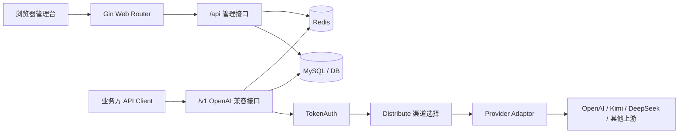
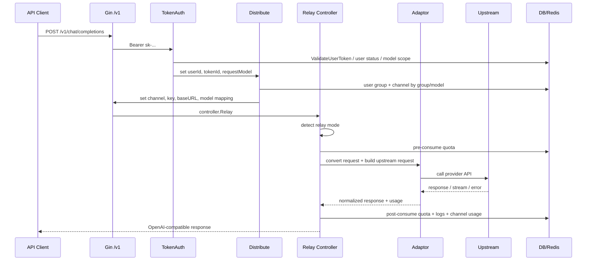
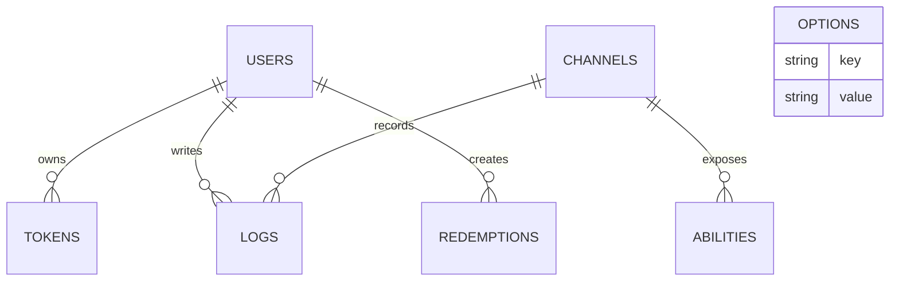

# 帧桥 API / One API 当前架构文档

最后更新：2026-05-21

## 结论

当前系统本质是一个单体 Go API 网关，内嵌 React 管理台，使用 MySQL 做主存储，Redis 做缓存和限流辅助。核心能力不是“模型调用”，而是把下游 OpenAI 兼容请求按用户、Token、模型、分组路由到合适的上游渠道，并在请求前后完成额度校验、额度扣减、日志记录和失败重试。

当前架构适合做文本、图片、音频等同步 OpenAI 兼容接口的中转。Seedance 视频生成属于异步任务业务，后续不应硬塞进现有 relay 同步链路，应在 One API 用户、Token、渠道、额度、日志能力之上新增任务层、账本和 worker。

## 系统边界



系统内职责：

- 前端管理台：用户、Token、渠道、日志、兑换码、系统设置。
- `/api` 管理接口：后台 CRUD、登录注册、系统配置、用户充值。
- `/v1` relay 接口：兼容 OpenAI SDK 的模型调用入口。
- 数据层：用户、Token、渠道、能力索引、日志、兑换码、配置项。
- 缓存层：Token、用户分组、用户额度、用户状态、渠道能力索引、限流状态。
- 适配层：把统一请求转换成不同上游服务商的请求和响应。

系统外职责：

- 上游模型平台的真实计费和余额。
- 自动支付、订单、发票、退款。
- 视频文件存储、异步任务调度、webhook。

## 代码模块

| 模块 | 目录 | 责任 |
|---|---|---|
| 启动入口 | `main.go` | 初始化配置、DB、Redis、缓存、i18n、HTTP server |
| 路由 | `router/` | 注册 `/api`、`/v1`、billing dashboard、前端静态路由 |
| 中间件 | `middleware/` | 登录鉴权、Token 鉴权、渠道分发、限流、CORS、日志、request id |
| 管理控制器 | `controller/` | 用户、渠道、Token、日志、兑换码、设置、渠道测试 |
| relay 控制器 | `relay/controller/` | 文本、图片、音频、代理请求的通用处理和计费 |
| 上游适配器 | `relay/adaptor/` | 不同模型服务商的 URL、header、请求转换、响应解析 |
| 数据模型 | `model/` | GORM 模型、DB 初始化、缓存、额度、日志、兑换码 |
| 公共能力 | `common/` | 配置、日志、Redis、HTTP client、工具函数、i18n |
| 前端 | `web/default/src/` | React 管理台源码 |
| 前端构建产物 | `web/build/default/` | Go 服务通过 `go:embed` 内嵌并提供静态资源 |

## 启动流程

`main.go` 启动顺序：

1. `common.Init()` 读取命令行参数、`SESSION_SECRET`、日志目录等。
2. `logger.SetupLogger()` 初始化日志。
3. `model.InitDB()` 根据 `SQL_DSN` 选择 MySQL / PostgreSQL / SQLite，并执行 GORM `AutoMigrate`。
4. `model.InitLogDB()` 根据 `LOG_SQL_DSN` 决定日志表是否使用独立数据库。
5. `model.CreateRootAccountIfNeed()` 首次启动时创建 `root / 123456`。
6. `common.InitRedisClient()` 根据 `REDIS_CONN_STRING` 和 `SYNC_FREQUENCY` 决定是否启用 Redis。
7. `model.InitOptionMap()` 加载系统配置项。
8. Redis 启用时，强制开启内存渠道缓存。
9. `model.InitChannelCache()` 构建 `group -> model -> channels` 内存索引。
10. 启动后台同步 goroutine：配置同步、渠道缓存同步、可选渠道自动测试、可选批量更新。
11. `openai.InitTokenEncoders()` 初始化 token 计数器。
12. `client.Init()` 初始化公共 HTTP client。
13. `i18n.Init()` 初始化多语言。
14. 创建 Gin server，挂载 request id、language、日志、session。
15. `router.SetRouter()` 注册所有路由。

本地开发的运行形态：

```text
Go 服务，端口 3000
  -> MySQL，localhost:13306
  -> Redis，localhost:16379
  -> 上游模型服务商 API
```

## 路由平面

### 1. 管理接口 `/api`

由 `router/api.go` 注册，主要给前端管理台使用。

典型路由：

| 路由 | 鉴权 | 责任 |
|---|---|---|
| `GET /api/status` | 无 | 返回系统名称、版本、额度换算、开关配置 |
| `POST /api/user/login` | 无 | 登录并写 session |
| `POST /api/user/register` | 无 | 注册用户 |
| `GET /api/user/self` | 用户 | 当前用户信息 |
| `GET /api/channel/` | 管理员 | 渠道列表 |
| `POST /api/channel/` | 管理员 | 新增渠道 |
| `GET /api/channel/test/:id` | 管理员 | 测试上游渠道 |
| `GET /api/token/` | 用户 | 当前用户 Token 列表 |
| `POST /api/token/` | 用户 | 创建 Token |
| `GET /api/log/` | 管理员 | 全量日志 |
| `GET /api/log/self` | 用户 | 当前用户日志 |
| `POST /api/user/topup` | 用户 | 兑换码充值 |
| `POST /api/topup` | 管理员 | 管理接口直接给用户加额度 |
| `GET /api/option/` | Root | 系统配置 |

管理接口使用 session 或用户 access token 鉴权，角色分为：

```text
普通用户 RoleCommonUser = 1
管理员 RoleAdminUser = 10
Root RoleRootUser = 100
```

### 2. Relay 接口 `/v1`

由 `router/relay.go` 注册，面向 OpenAI SDK 和业务调用方。

已接入的主要接口：

- `GET /v1/models`
- `POST /v1/chat/completions`
- `POST /v1/completions`
- `POST /v1/embeddings`
- `POST /v1/images/generations`
- `POST /v1/audio/transcriptions`
- `POST /v1/audio/translations`
- `POST /v1/audio/speech`
- `POST /v1/moderations`

部分 OpenAI Assistants、Files、Fine-tuning 路由已占位，但返回 `API not implemented`。

Relay 接口中间件顺序：

```text
RelayPanicRecover
  -> TokenAuth
  -> Distribute
  -> controller.Relay
```

### 3. Billing Dashboard 兼容接口

由 `router/dashboard.go` 注册：

- `/dashboard/billing/subscription`
- `/v1/dashboard/billing/subscription`
- `/dashboard/billing/usage`
- `/v1/dashboard/billing/usage`

它们用 One API 的额度数据模拟 OpenAI billing 响应，供部分客户端展示余额和用量。

### 4. 前端静态资源

由 `router/web.go` 注册。

Go 通过 `go:embed web/build/*` 内嵌前端构建产物。生产和本地源码服务都直接从 Go 进程提供 React 静态资源。非 `/api`、非 `/v1` 的未知路径会回退到 `index.html`，交给 React Router。

## Relay 请求链路



### TokenAuth

`middleware.TokenAuth()` 负责：

- 解析 `Authorization: Bearer sk-...`。
- 从 Token key 查 `tokens` 表或 Redis 缓存。
- 校验 Token 状态、过期状态、用户状态。
- 校验 Token 的模型白名单。
- 校验 Token 的子网限制。
- 设置 `ctxkey.Id`、`ctxkey.TokenId`、`ctxkey.TokenName`、`ctxkey.RequestModel`。
- 管理员可以通过 `sk-token-channelId` 或代理路径指定渠道，普通用户不能指定渠道。

### Distribute

`middleware.Distribute()` 负责选上游渠道。

选择逻辑：

1. 如果请求指定了渠道 ID，则直接加载该渠道。
2. 否则读取用户分组和请求模型。
3. 从 `group -> model -> channels` 索引中选一个可用渠道。
4. 优先选最高 `priority` 的渠道；同优先级中随机。
5. 把渠道类型、渠道 ID、上游 Key、Base URL、模型映射、渠道配置写入 Gin context。

渠道选择依赖 `abilities` 表。每次新增或更新渠道时，会按渠道的 `models` 和 `group` 生成能力索引：

```text
group + model + channel_id -> enabled + priority
```

### Relay Controller

`controller.Relay()` 按路径识别 relay mode：

- 文本：`RelayTextHelper`
- 图片：`RelayImageHelper`
- 音频：`RelayAudioHelper`
- 代理：`RelayProxyHelper`

如果上游返回 429 或 5xx，且请求没有指定固定渠道，会按 `RetryTimes` 尝试切换同模型同分组的其他渠道。

如果错误满足自动禁用规则，`monitor.DisableChannel()` 会把渠道置为自动禁用，并通知 Root 用户。

## 上游适配器机制

统一接口定义在 `relay/adaptor/interface.go`：

```text
Init
GetRequestURL
SetupRequestHeader
ConvertRequest
ConvertImageRequest
DoRequest
DoResponse
GetModelList
GetChannelName
```

`relay/adaptor.go` 根据 API type 返回具体适配器。大部分 OpenAI 兼容服务复用 `openai.Adaptor`，通过 channel type 调整：

- 请求 URL
- Header
- 模型列表
- 少数服务的特殊 path 或参数

完全非 OpenAI 兼容的服务使用独立适配器，例如 Gemini、Anthropic、Baidu、Xunfei、Replicate 等。

适配层的边界是：

```text
One API 内部统一请求模型
  -> adaptor 转为上游格式
  -> 上游响应
  -> adaptor 转回 OpenAI 兼容响应并提取 usage
```

## 数据模型

核心表：

| 表 | 模型 | 作用 |
|---|---|---|
| `users` | `model.User` | 用户、角色、状态、分组、账号额度 |
| `tokens` | `model.Token` | 下游 API Token、Token 额度、模型白名单、子网限制 |
| `channels` | `model.Channel` | 上游渠道配置、Key、模型、分组、Base URL、优先级 |
| `abilities` | `model.Ability` | 渠道能力索引，供按分组和模型选渠道 |
| `logs` | `model.Log` | 消费、充值、管理、系统、渠道测试日志 |
| `redemptions` | `model.Redemption` | 兑换码、额度、状态、兑换时间 |
| `options` | `model.Option` | 系统配置项 |

关系：



注意：`logs` 可以通过 `LOG_SQL_DSN` 放到独立数据库；未配置时和主库共用。

## 缓存和同步

Redis 启用条件：

```text
REDIS_CONN_STRING 非空
SYNC_FREQUENCY 非空
```

Redis 用途：

- Token 缓存：`token:<key>`
- 用户分组缓存：`user_group:<id>`
- 用户额度缓存：`user_quota:<id>`
- 用户状态缓存：`user_enabled:<id>`
- 用户分组可用模型缓存：`group_models:<group>`
- API / Web / Critical 限流状态

内存缓存用途：

- `group2model2channels`：按分组和模型索引可用渠道。

同步机制：

- `SyncOptions` 周期性从 DB 更新运行时配置。
- `SyncChannelCache` 周期性重建渠道内存索引。
- 批量更新开启后，额度和用量更新先进入内存聚合，再周期性落库。

当前本地配置同时启用 Redis 和内存渠道缓存，`SYNC_FREQUENCY=60`。

## 额度和计费链路

One API 的额度是内部账本，不等于上游平台真实余额。

请求前：

1. 解析请求模型。
2. 计算 prompt tokens。
3. 按模型倍率和用户组倍率计算预扣额度。
4. 检查用户额度。
5. 检查 Token 额度。
6. 预扣用户额度和 Token 额度。

请求后：

1. 从上游响应提取 usage。
2. 计算真实消费额度。
3. 和预扣额度做差额结算。
4. 更新用户已用额度、Token 已用额度、渠道已用额度。
5. 写消费日志。

请求失败：

- 如果上游请求失败或响应解析失败，返还预扣额度。

扣费公式：

```text
quota = ceil((prompt_tokens + completion_tokens × completion_ratio)
             × model_ratio
             × group_ratio)
```

倍率来源：

- 模型倍率：`relay/billing/ratio/model.go`
- 分组倍率：`relay/billing/ratio/group.go`
- 输出倍率：`relay/billing/ratio/model.go`

默认额度显示换算：

```text
QuotaPerUnit = 500000
500000 额度 = $1
```

## 支付和兑换边界

当前没有内置完整支付系统。

已有能力：

- 管理员生成兑换码。
- 用户在 `/topup` 输入兑换码。
- 系统把兑换码额度加到用户 `quota`。
- 管理员可通过 `/api/topup` 直接给用户加额度。
- `TopUpLink` 只是外部购买链接，不处理支付回调。

真实商业闭环需要外部支付系统：

```text
用户支付
  -> 外部支付系统确认订单
  -> 发兑换码或调用管理接口加额度
  -> One API 内部额度增加
```

上游平台真实费用仍由上游账号扣除。

## 前端架构

前端是 React 单页应用，源码在 `web/default/src`。

核心路由：

| 路由 | 页面 |
|---|---|
| `/` | 首页 |
| `/channel` | 渠道管理 |
| `/token` | Token 管理 |
| `/redemption` | 兑换码管理 |
| `/topup` | 用户充值 |
| `/user` | 用户管理 |
| `/setting` | 系统设置 |
| `/log` | 日志 |
| `/dashboard` | 数据看板 |

前端通过 `helpers/api.js` 创建 axios 实例，默认请求同源后端。`/api/status` 返回的系统名、logo、额度换算、充值链接等会写入 localStorage，供页面渲染。

## 配置来源

配置来源分三类：

1. 环境变量和命令行参数：启动时读取。
2. `options` 表：后台系统设置写入，运行时可同步。
3. 数据表配置：用户、Token、渠道、兑换码。

重要环境变量：

| 变量 | 作用 |
|---|---|
| `PORT` | HTTP 服务端口 |
| `SQL_DSN` | 主数据库连接 |
| `LOG_SQL_DSN` | 日志数据库连接，可选 |
| `REDIS_CONN_STRING` | Redis 连接 |
| `SYNC_FREQUENCY` | 配置和缓存同步周期 |
| `SESSION_SECRET` | Cookie session 加密密钥 |
| `FRONTEND_BASE_URL` | 非 master 节点前端重定向地址 |
| `CHANNEL_TEST_FREQUENCY` | 自动渠道测试周期 |
| `BATCH_UPDATE_ENABLED` | 是否开启批量落库 |

## 可靠性机制

已有机制：

- Request ID：每个请求写入响应头和日志。
- Gin Recovery：基础 panic 恢复。
- RelayPanicRecover：relay 专用 panic 保护。
- 限流：Web、API、Critical 接口分开限流，优先使用 Redis。
- 重试：上游 429 / 5xx 等错误可切换渠道重试。
- 自动禁用：认证、余额、权限类错误可自动禁用渠道。
- 成功率监控：可按渠道近期成功率自动禁用。
- 预扣退款：上游失败会返还预扣额度。

主要限制：

- 单体进程，业务逻辑和后台管理在同一服务内。
- 现有 relay 以同步请求为中心，不适合长耗时异步视频任务。
- 日志和额度更新部分使用 goroutine，强一致审计能力不足。
- 当前兑换和充值不是订单系统，不具备支付回调、对账、退款。
- 上游渠道 Key 存在数据库中，生产环境需要加强密钥管理。

## Seedance 二开建议

不要把视频生成强行塞进 `relay/controller/text.go` 或 OpenAI 兼容文本链路。

建议新增独立任务层：

```text
POST /v1/videos/generations
GET  /v1/videos/tasks/:id
POST /v1/videos/tasks/:id/cancel
```

新增核心模块：

- `video_tasks`：任务主表。
- `video_task_events`：任务状态事件。
- `provider_jobs`：上游任务 ID 和状态映射。
- `ledger_entries`：append-only 账本，记录预扣、结算、退款。
- Worker：轮询上游任务状态，推进状态机。
- Storage：结果视频转存对象存储。
- Webhook：任务完成 / 失败事件通知。

可复用现有能力：

- 用户和登录体系。
- Token 鉴权。
- 渠道管理。
- 用户分组。
- 基础额度体系。
- 日志页面。
- 管理后台结构。

需要补强的能力：

- 任务级幂等。
- 可审计账本。
- 失败退款规则。
- 异步 worker 和重试策略。
- 视频结果存储和过期策略。
- 管理后台任务面板。

## 架构判断

当前 One API 架构的核心价值是“同步模型网关 + 额度账本 + 管理后台”。它可以快速支撑本地 demo 和早期文本模型中转，但视频生成产品的核心不是转发一个 HTTP 请求，而是管理异步任务生命周期和资金账本。

因此后续演进路线应是：

```text
保留 One API 作为账户、Token、渠道、额度和后台基座
  -> 新增视频任务域
  -> 新增独立账本
  -> 新增 worker 和对象存储
  -> 最后再做自动支付
```
